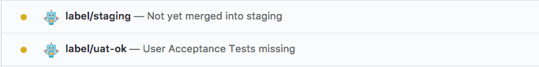

Label Checker Probot
====================

This Github bot adds commit status to your pull requests depending
on label being present on it. This can be used to help coordinate
when something is ready for test or tested:



Installation
------------

The bot needs to be installed and granted access to the repos that needs to be checked.
The deployed version is hosted on Glitch, so not open to the whole world right now.

Configuration
-------------

The labels to watch are configured by the file `.github/prs-label-checker.yml` in the repo.
Here is an example for the above preview:

```yaml
staging:
  label: staging
  success: Merged into staging
  pending: Not yet merged into staging
uat:
  label: UAT OK
  success: User Acceptance Tested
  pending: User Acceptance Tests missing
```

- The root keys (`staging` and `uat`) are not affecting the checks name.
- The value for `label` nested key must match a label name in your repo
- The `success` and `pending` nested keys are optional.
- Each status is pending by default, turns to success when corresponding 
  label is added, and turns back to pending if the label is removed.

Hosting your own
----------------

It's easy to host a version of this app yourself, it start by
[remixing the Glitch version](https://glitch.com/edit/#!/remix/probot-labels-checker).

You will have configure a few things, described in the steps below. These steps
are from the Hello World example from Probot at time of writing, if they stop working, 
you might want to look at [the latest version](https://glitch.com/edit/#!/probot-hello-world). 

1. [Configure a new app on Github](https://github.com/settings/apps/new).
    - For the Homepage URL, you can use your repository URL or website URL. 
    - For the Webhook URL, use `https://www.example.com`. This will be replaced later.
    - For the Webhook Secret, open a terminal and run `openssl rand -base64 32`. 
      Copy/paste the outputted value to the Webhook Secret box. Keep this handy
      until Step 4.
    - Choose the permissions you want to give your bot based on what you want to build (ex. issues bot, PR bot, hybrid).
    - Download your private key.
    - Save your changes.

2. Click the **New File** button (at left) and type `.data/private-key.pem`. Then click **Add File**. Open the private key you downloaded from Github, and copy/paste the contents into your new file.

3. Edit the `.env` file (at left) with your app credentials. 
    - `APP_ID` can be found in the About section of your Github app.
    - `WEBHOOK_SECRET` is the value you generated in Step 2.
    - `PRIVATE_KEY_PATH=` should be set to `.data/private-key.pem`. 
    - `NODE_ENV=` should be set to `production`. 

4. Wait for app to load. A green `Live` label should show up next to the **Show** button when it's finished loading.


Credits
-------

This was built using [Probot](https://probot.github.io/) and [Glitch](https://glitch.com).
